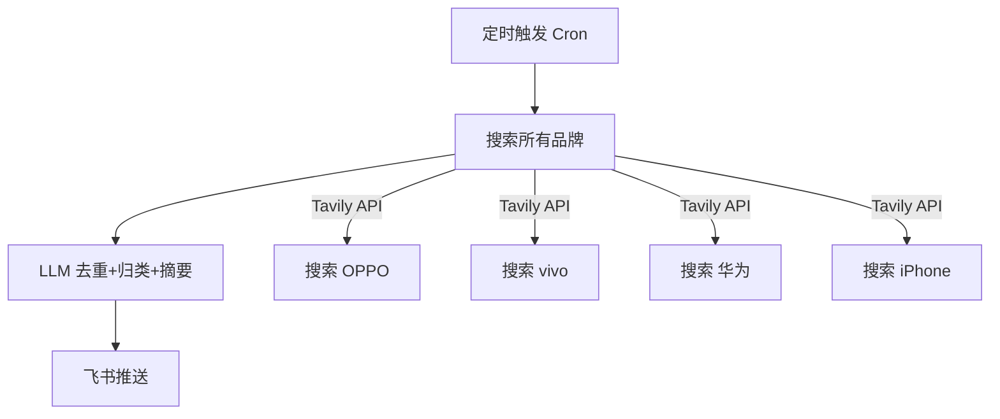

# 📱 Phone Monitor — 手机新品发布情报监控系统

> 多品牌竞品情报自动化监控，搜索 → LLM 分析 → 飞书推送，全自动每日运行。

---

## 效果预览

每天 09:00 自动推送以下内容到飞书群：

```
📱 手机新品情报日报（2025-01-15）

🔵 OPPO
- **OPPO Find X8 Ultra** | 1月 | 骁龙8 Elite+双潜望长焦，主打影像旗舰
  - 来源: IT之家 | 影响: 新品曝光

⚪ iPhone
- **iPhone SE 4** | 预计3月发布 | OLED屏+自研5G基带，起售价或低于4000元
  - 来源: 威锋网 | 影响: 预热曝光

📊 今日总结
- 今日最重磅: OPPO Find X8 Ultra 影像规格曝光
- 趋势观察: 各品牌 Q1 新机节奏明显加速
```

---

## 架构



---

## 快速开始

### 1. 克隆 / 下载

```bash
cd phone-monitor
```

### 2. 配置 API Key

```bash
cp .env.example .env
vi .env   # 填入你的 API Key
```

需要准备：

| 服务 | 用途 | 获取方式 | 费用 |
|------|------|----------|------|
| **Tavily** | 搜素引擎 API | [app.tavily.com](https://app.tavily.com) 注册 | 免费 1000 次/月 |
| **DeepSeek** | LLM 分析 | [platform.deepseek.com](https://platform.deepseek.com) 充值 | ~¥0.5/千次 |
| **飞书机器人** | 消息推送 | 飞书群 → 设置 → 群机器人 → Webhook | 免费 |

> **省钱提示**：每天 1 次搜索+分析 ≈ 0.01 元/天（DeepSeek）

### 3. 安装 & 运行

```bash
# 一键部署
chmod +x setup.sh
./setup.sh

# 或手动操作
pip install -r requirements.txt
python main.py                    # 正式运行
DRY_RUN=true python main.py       # 测试模式（仅打印）
```

### 4. 设置定时任务

```bash
# 每天 09:00 自动运行
crontab -e
# 添加一行：
0 9 * * * cd /path/to/phone-monitor && venv/bin/python main.py >> cron.log 2>&1
```

---

## 项目结构

```
phone-monitor/
├── main.py                   # 入口 + 流程编排
├── phone_monitor/
│   ├── __init__.py
│   ├── __main__.py           # 支持 python -m phone_monitor
│   ├── config.py             # 配置管理（环境变量）
│   ├── searcher.py           # 搜索模块（Tavily API）
│   ├── analyzer.py           # LLM 分析模块（去重/归类/摘要）
│   └── notifier.py           # 飞书推送模块
├── .env.example              # 配置模板
├── requirements.txt          # 依赖（仅 requests）
├── setup.sh                  # 一键部署脚本
└── README.md
```

---

## 自定义

| 需求 | 改哪里 |
|------|--------|
| 换品牌 | 修改 `.env` 中的 `BRANDS` |
| 换 LLM | 修改 `.env` 中的 `LLM_BASE_URL` + `LLM_MODEL` + `LLM_API_KEY` |
| 换推送渠道 | 修改 `notifier.py` 中的 `push_to_feishu()`（支持钉钉/Slack 等） |
| 改分析逻辑 | 修改 `analyzer.py` 中的 `system_prompt` |
| 调搜索深度 | 修改 `searcher.py` 中的 `search_depth: "advanced"` |

---

## 简历价值

这个项目可以展示以下技术能力：

- **Python 工程** — 模块化设计、异常处理、日志、类型注解
- **LLM 应用** — Prompt 工程、结构化输出控制、降级策略
- **API 集成** — Tavily Search、LLM API、飞书 Webhook
- **自动化运维** — Cron 定时任务、环境变量配置、一键部署脚本
- **数据处理** — 数据清洗、去重、归类、摘要

---

## License

MIT
